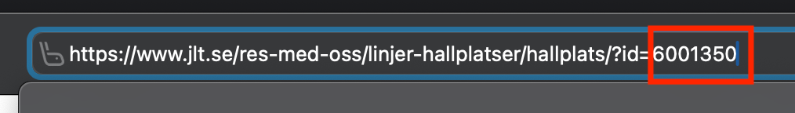
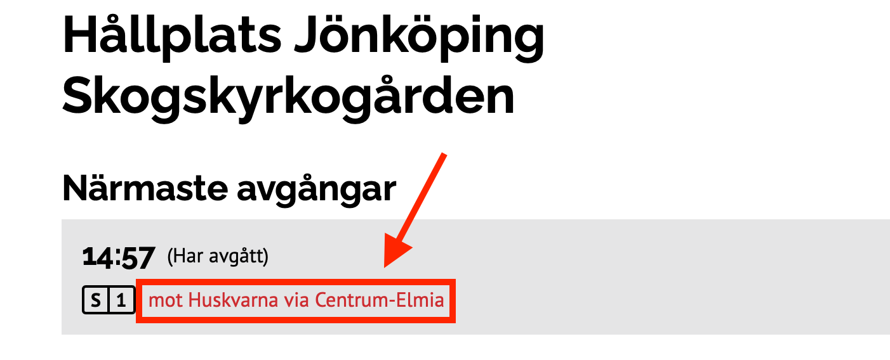
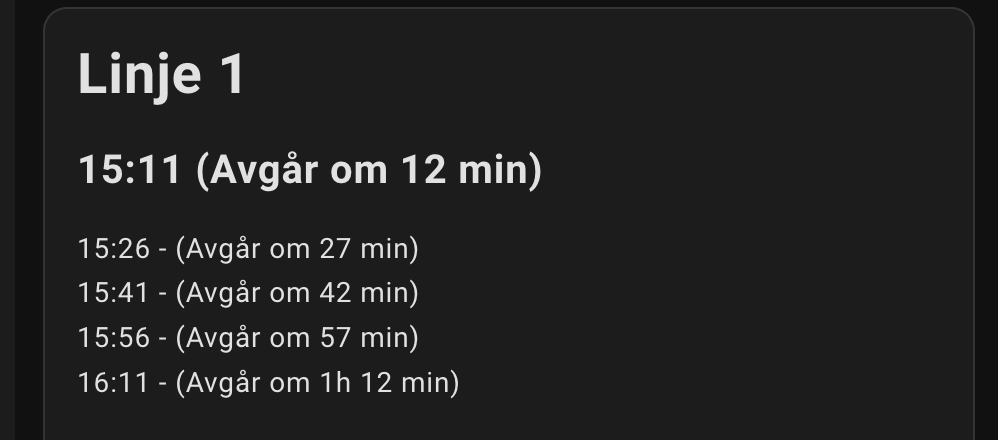
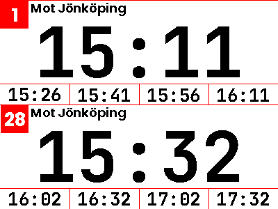

# JltBusSchedule

This is a Python script that collects JLT (Jönköpings Länstrafik) bus schedules for Home Assistant use, 
it needs to be run in the AppDaemon addon. 

The script uses screen scraping to collect upcoming bus departure times, and publishes them as sensors in Home Assistant.

The scraping url used is https://www.jlt.se/api/StopAreaApi/GetClosestDepartures?fromId={stop_id}&take=20

## Usage

In the `jlt_bus_schedule.py` file, you need to make some changes. 

 1. Change TARGETS to reflect your lines, name and direction. 
 2. Set TOO_LATE_TRESHOLD to the number of minutes it takes to walk to the bus stop
 3. Set NUMBER_OF_DEPARTURES to the number of upcoming departures to publish

### TARGETS

`TARGET` takes a list of wanted departures. 

Go to https://www.jlt.se/res-med-oss/linjer-hallplatser/ and search for the bus stop. Click
the wanted one and look at the url. The value of `stop_id` is the last numbers of the url.



Next, copy the destination text from that page for the `destination` field.



```python
# Stops to query: (stop_id, destination, direction)
TARGETS = [
            (6001350, "Huskvarna via Centrum-Elmia", "north"),
            (6001353, "Jönköping Rådhusparken",       "north"),
          ]
# "too_late" threshold
TOO_LATE_TRESHOLD = 8
# Number of coming departures to handle
NUMBER_OF_DEPARTURES = 6
```

Add a name for 'direction', this is just a shorter alias for the `direction` field, such as `north` or `west`. 
This will be used in the sensor name so keep it short.

## Sensors

| Sensor name                                            | Attributes                                                | Description                                                    |
|--------------------------------------------------------|-----------------------------------------------------------|----------------------------------------------------------------|
| 
| sensor.jlt_bus_<line number>_<direction>_departure_<n> | line_number<br>direction<br>time_to_departure<br>too_late | Departure [n] (1 to number of departures set)                  |
| sensor.jlt_bus_<line number>_<direction>_departure_<n>_departure | (none) | Departure [n] time                                             |
| sensor.jlt_bus_<line number>_<direction>_departure_<n>_time_to_departure | (none) | Time to departure (textual)                                    |
| sensor.jlt_bus_<line number>_<direction>_departure_<n>_too_late | (none) | True if now is more than departure time plus TOO_LATE_TRESHOLD |

 > Note: The first sensor above is the normal sensor to use, as it contains all data as attributes. 
 > If you use it as a trigger for an automation however, it will trigger on changes in the attributes as well.
 > The attribute time_to_departure for instance will change every minute.   

## Dashboard

You can use the markdown card to display the schedule in Home Assistant. 



```jinja
# Linje 1
## {{ states('sensor.jlt_bus_1_north_departure_1') }} ({{ states('sensor.jlt_bus_1_north_departure_1_time_to_departure') }})

{{states('sensor.jlt_bus_1_north_departure_2') }} - ({{ states('sensor.jlt_bus_1_north_departure_2_time_to_departure') }})
{{states('sensor.jlt_bus_1_north_departure_3') }} - ({{ states('sensor.jlt_bus_1_north_departure_3_time_to_departure') }})
{{states('sensor.jlt_bus_1_north_departure_4') }} - ({{ states('sensor.jlt_bus_1_north_departure_4_time_to_departure') }})
{{states('sensor.jlt_bus_1_north_departure_5') }} - ({{ states('sensor.jlt_bus_1_north_departure_5_time_to_departure') }})
```

## OpenEPaperLink 

OpenEPaperLink uses automations to send content to EPaper tags. 

This example uses a 4.2" epaper tag.

> Note that it uses the `.._departure` entity to avoid triggering on attribute changes



```yaml
alias: E-Paper Bus Schedule
description: ""
triggers:
  - trigger: state
    entity_id:
      - sensor.jlt_bus_1_north_departure_1_departure
      - sensor.jlt_bus_28_north_departure_1_departure
conditions: []
actions:
  - delay:
      hours: 0
      minutes: 0
      seconds: 5
      milliseconds: 0
  - action: open_epaper_link.drawcustom
    data:
      rotate: 0
      dither: 0
      ttl: 60
      dry-run: false
      payload:
        - type: line
          x_start: 0
          y_start: 0
          x_end: 400
          y_end: 0
          width: 1
          fill: red
        - type: line
          x_start: 0
          y_start: 150
          x_end: 400
          y_end: 150
          width: 1
          fill: red
        - type: rectangle
          x_start: 0
          y_start: 0
          x_end: 40
          y_end: 40
          width: 1
          outline: red
          fill: red
        - type: text
          value: 1
          font: ppb.ttf
          x: 22
          "y": 22
          size: 26
          color: white
          anchor: mm
        - type: text
          value: Mot Jönköping
          font: ppb.ttf
          x: 44
          "y": 18
          size: 18
          color: black
          anchor: ls
        - type: rectangle
          x_start: 1
          y_start: 150
          x_end: 40
          y_end: 190
          width: 1
          outline: red
          fill: red
        - type: text
          value: 28
          font: ppb.ttf
          x: 22
          "y": 172
          size: 26
          color: white
          anchor: mm
        - type: text
          value: Mot Jönköping
          font: ppb.ttf
          x: 44
          "y": 168
          size: 18
          color: black
          anchor: ls
        - type: text
          value: "{{ states('sensor.jlt_bus_1_north_departure_1_departure') }}"
          font: JetBrainsMono-Bold.ttf
          x: 200
          "y": 75
          size: 100
          color: black
          anchor: mm
        - type: line
          x_start: 0
          y_start: 120
          x_end: 400
          y_end: 120
          width: 1
          fill: red
        - type: line
          x_start: 100
          y_start: 120
          x_end: 100
          y_end: 150
          width: 1
          fill: red
        - type: line
          x_start: 200
          y_start: 120
          x_end: 200
          y_end: 150
          width: 1
          fill: red
        - type: line
          x_start: 300
          y_start: 120
          x_end: 300
          y_end: 150
          width: 1
          fill: red
        - type: text
          value: "{{ states('sensor.jlt_bus_1_north_departure_2_departure') }}"
          font: JetBrainsMono-Bold.ttf
          x: 50
          "y": 136
          size: 26
          color: black
          anchor: mm
        - type: text
          value: "{{ states('sensor.jlt_bus_1_north_departure_3_departure') }}"
          font: JetBrainsMono-Bold.ttf
          x: 150
          "y": 136
          size: 26
          color: black
          anchor: mm
        - type: text
          value: "{{ states('sensor.jlt_bus_1_north_departure_4_departure') }}"
          font: JetBrainsMono-Bold.ttf
          x: 250
          "y": 136
          size: 26
          color: black
          anchor: mm
        - type: text
          value: "{{ states('sensor.jlt_bus_1_north_departure_5_departure') }}"
          font: JetBrainsMono-Bold.ttf
          x: 350
          "y": 136
          size: 26
          color: black
          anchor: mm
        - type: text
          value: "{{ states('sensor.jlt_bus_28_north_departure_1_departure') }}"
          font: JetBrainsMono-Bold.ttf
          x: 200
          "y": 225
          size: 100
          color: black
          anchor: mm
        - type: line
          x_start: 0
          y_start: 270
          x_end: 400
          y_end: 270
          width: 1
          fill: red
        - type: line
          x_start: 100
          y_start: 270
          x_end: 100
          y_end: 300
          width: 1
          fill: red
        - type: line
          x_start: 200
          y_start: 270
          x_end: 200
          y_end: 300
          width: 1
          fill: red
        - type: line
          x_start: 300
          y_start: 270
          x_end: 300
          y_end: 300
          width: 1
          fill: red
        - type: text
          value: "{{ states('sensor.jlt_bus_28_north_departure_2_departure') }}"
          font: JetBrainsMono-Bold.ttf
          x: 50
          "y": 286
          size: 26
          color: black
          anchor: mm
        - type: text
          value: "{{ states('sensor.jlt_bus_28_north_departure_3_departure') }}"
          font: JetBrainsMono-Bold.ttf
          x: 150
          "y": 286
          size: 26
          color: black
          anchor: mm
        - type: text
          value: "{{ states('sensor.jlt_bus_28_north_departure_4_departure') }}"
          font: JetBrainsMono-Bold.ttf
          x: 250
          "y": 286
          size: 26
          color: black
          anchor: mm
        - type: text
          value: "{{ states('sensor.jlt_bus_28_north_departure_5_departure') }}"
          font: JetBrainsMono-Bold.ttf
          x: 350
          "y": 286
          size: 26
          color: black
          anchor: mm
      background: white
    target:
      device_id:
        - b69497621e4282849f8de202463188c3
        - 8435b9864aff46742e0754bafad0aeb7
mode: queued
max: 5
```